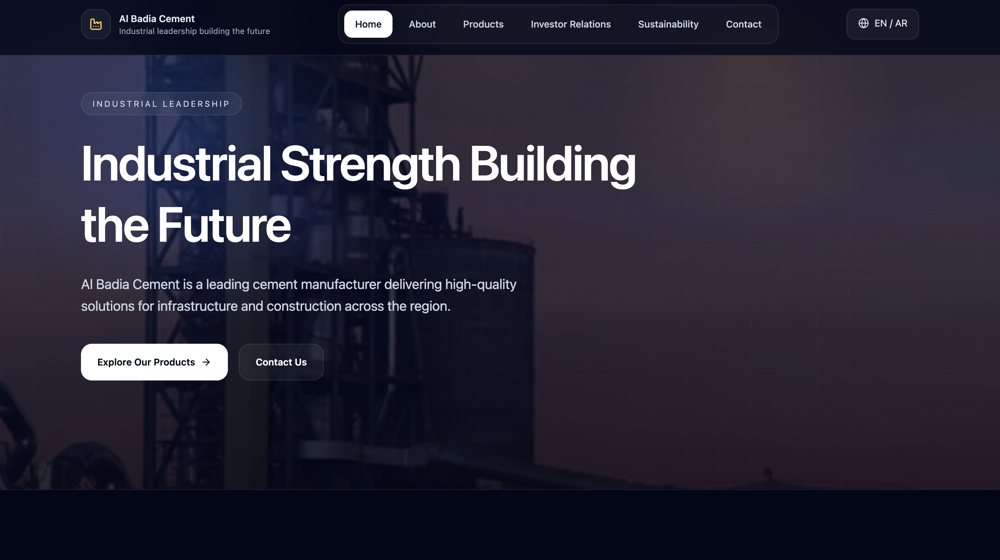
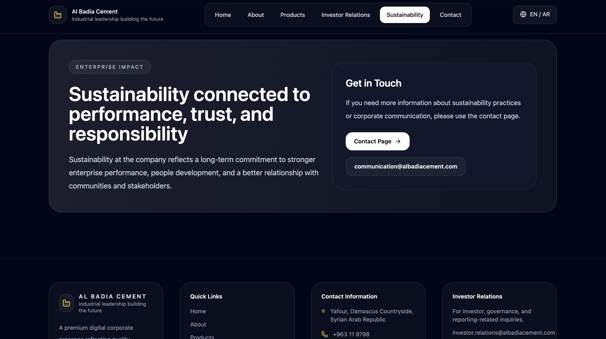
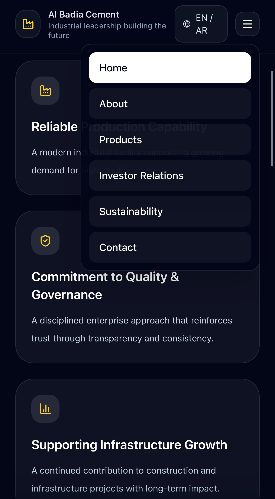

# 🏭 Al Badia Cement – Corporate Website Redesign

A modern, bilingual (Arabic / English) corporate website redesign for a large-scale cement manufacturing company.

🔗 **Live Demo:** https://cement-corporate.vercel.app/?lang=en

---

## ✨ Overview

This project is a high-end redesign of an industrial corporate website.

Focus:
- Premium corporate design
- Strong visual identity
- Bilingual experience (RTL + LTR)
- Responsive and modern UI

---

## 📸 Screenshots


### Homepage


### About Page


### Mobile View
<p align="center">
  
</p>
---

## 🚀 Features

- 🌍 Arabic / English language support
- ↔️ RTL & LTR layouts
- 📱 Fully responsive design
- 🎯 Clean corporate UI
- 🧭 Smart navigation system
- 🎬 Smooth reveal animations
- ⚡ Optimized performance with Next.js

---

## 🛠 Tech Stack

- Next.js (App Router)
- TypeScript
- Tailwind CSS
- Vercel (Deployment)

---

## 📦 Run locally

```bash
npm install
npm run dev
```

---

## 🎯 Purpose

This project was built as a professional portfolio piece and concept redesign for enterprise-level clients.

---

## 👨‍💻 Author

Feras Hababa  
GitHub: https://github.com/FerasHB
